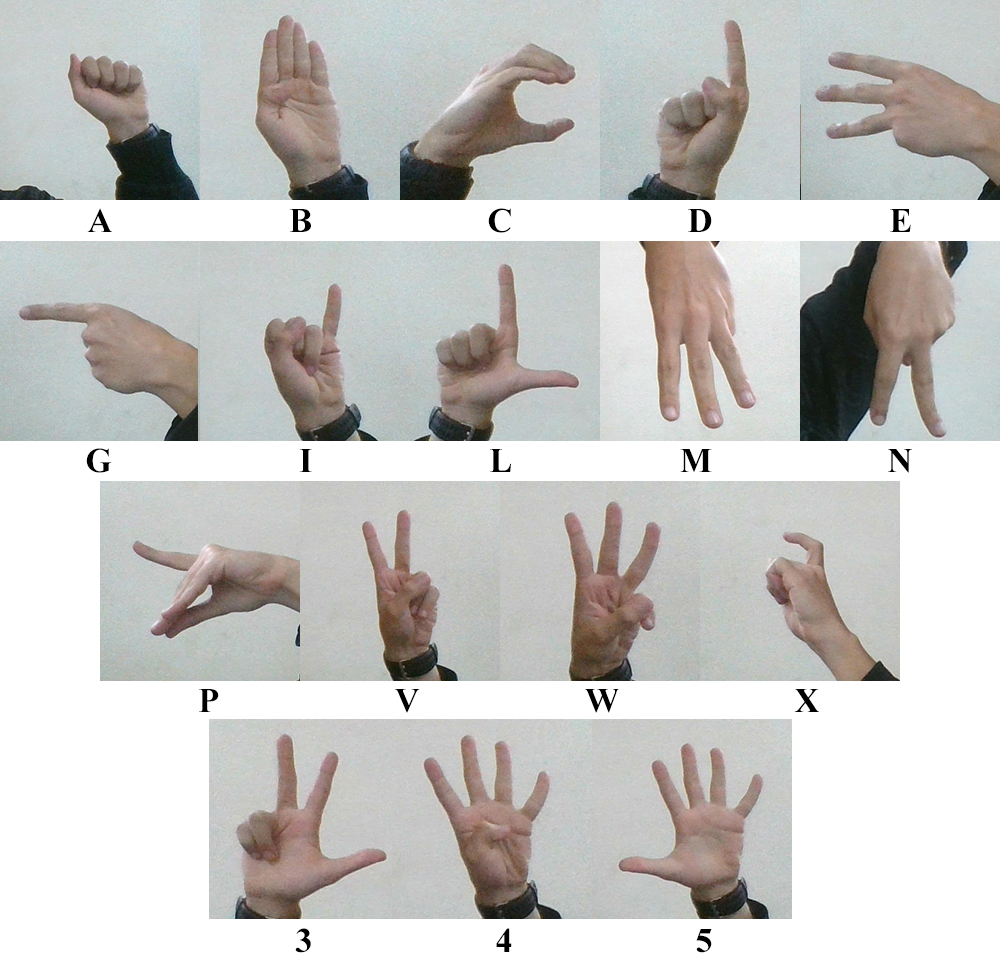

# American Sign Language Recongnition System
A python program that detects and recognizes American Sign Language from real-time video and translates it into text using various image processing techniques.

<!-- TABLE OF CONTENTS -->
## Table of Contents

* [About the Project](#about-the-project)
  * [Conditions for Good Accuracy](#conditions-for-good-accuracy)
  * [Built With](#built-with)
* [Getting Started](#getting-started)
  * [Prerequisites](#prerequisites)
  * [Installation](#installation)
* [Contributers](#contributers)


<!-- ABOUT THE PROJECT -->
## About The Project

This is a real-time American Sign Language (ASL) recognition system that goes through 3 phases; hand segmentation which detects skin using Log-Chromaticity Color Space (LCCS) and then removes the face from the frame, feature extraction that uses many image processing algorithms, and classification that uses these features without any type of learning or training to recognize 17 different letters/numbers.




### Conditions for Good Accuracy:
* Normal lightening conditions.
* Only one hand in the image.


### Built With
* Anaconda
* SciKit-Image
* OpenCV


<!-- GETTING STARTED -->
## Getting Started

### Prerequisites

* Anaconda

* OpenCV
```sh
pip install opencv-python
```


### Installation

1. Clone the repo
```sh
git clone https://github.com/AhmedEssamDakrory/Hand-Gesture-Detection.git
```
2. open sign language recognition.ipynb with jupyter notebook and run all cells


## Contributers
[Ahmed Essam](https://github.com/AhmedEssamDakrory)
[Ahmed ElKarashily](https://github.com/karashily)
[Abdullah Ezzat](https://github.com/abdulezzat)
[Omar Ahmed](https://github.com/OmarDesoky)


